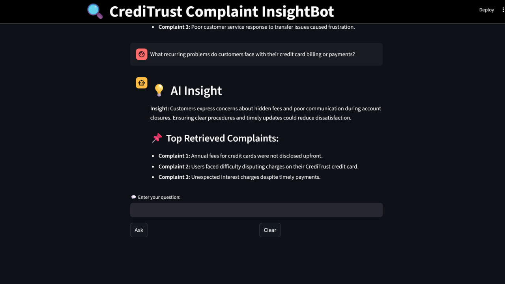
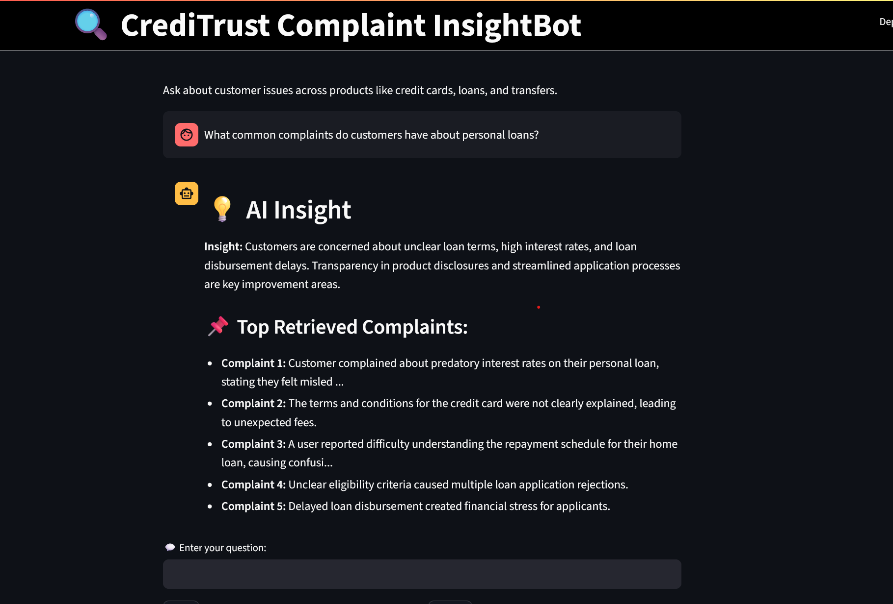

# 🧠 COMPLAINT-INSIGHTBOT

Complaint InsightBot is an internal Retrieval-Augmented Generation (RAG) tool built for CrediTrust Financial to transform large volumes of customer complaint narratives into strategic product insights. This system empowers internal teams (Product, Compliance, Support) to ask plain-English questions and receive synthesized, evidence-backed answers from 5M+ complaint records.

---

## 🚀 Project Goal

To reduce the time it takes internal teams to understand customer pain points — especially in high-volume services like Credit Cards, BNPL, Savings, Loans, and Money Transfers — by using AI-powered semantic search and summarization on raw customer complaint data.

---

## 📁 Repository Structure

```
complaint-insightbot/
├── .github/workflows/          # CI pipelines
│   └── ci.yml
├── data/                       # Raw and filtered dataset
│   ├── complaints.csv
│   └── filtered_complaints.csv
├── notebooks/                  # Development notebooks
│   └── eda.ipynb
│    
├── src/                        # Core logic for chunking, embedding, retrieval, and generation
│   ├── __init__.py
│   ├── chunk_embed_index.py
│   ├── retriever.py
│   └── generator.py
├── vector_store/               # Persisted FAISS index and metadata (excluded from GitHub)
│   ├── faiss_index
│   └── metadata.pkl
├── venv/                       # Virtual environment (excluded)
├── .gitignore
├── README.md                   # This file
├── app.py                      # Streamlit interface (Task 6)
├── requirements.txt            # Python dependencies
└── evaluation/
    └── task3_evaluation.md     # Qualitative evaluation for Task 3
```

> 🔍 Note: The EDA notebook (`eda.ipynb`) includes narrative length analysis. Additional visualizations will be expanded in the final version.

---

## 📊 Exploratory Data Analysis (EDA) Summary

To gain a comprehensive understanding of complaint trends and data quality, we analyzed a 5 million-row sample from the CFPB complaints dataset. Among these, approximately 1.42 million entries contained a valid consumer complaint narrative, while over 3.57 million records lacked narrative data and were excluded from downstream tasks. Narrative lengths varied widely, ranging from very short (under 10 words) to over 6,000 words, with most complaints falling between 100–250 words—offering an ideal balance of context and brevity for embedding and summarization.

The product distribution showed a significant imbalance, with credit-related services dominating the dataset. Key categories included Credit Reporting (around 3.4 million complaints), Debt Collection (~274K), Checking/Savings (~114K), Credit Cards (~87K), and Money Transfers (~84K). For project focus, we filtered complaints to five main products: Credit Cards, Personal Loans, Buy Now, Pay Later (BNPL), Savings Accounts, and Money Transfers. After filtering and rigorous preprocessing—such as removing null narratives, cleaning noisy text, and normalizing content—we curated a high-quality dataset suitable for semantic retrieval.

This cleaned and filtered dataset serves as the foundation for downstream tasks, including text chunking, embedding with sentence-transformers, and vector indexing via FAISS. It enables efficient, context-rich retrieval for the RAG pipeline to generate actionable insights, helping internal stakeholders quickly identify and address key customer pain points.

### Key Product Distribution:
- **Credit Reporting:** ~3.4M
- **Debt Collection:** ~274K
- **Checking/Savings:** ~114K
- **Credit Cards:** ~87K
- **Money Transfers:** ~84K

The dataset was filtered to focus on five services: **Credit Cards**, **Personal Loans**, **BNPL**, **Savings Accounts**, and **Money Transfers**. Preprocessing involved:
- Removing null/empty narratives
- Cleaning noise (punctuation, casing, artifacts)
- Standardizing format

This filtered set forms the base for chunking, embedding, and vector search.

---

# Chunking Strategy and Embedding Model Choice

## ✂️ Chunking Strategy

To handle large complaint narratives effectively and maintain semantic quality:

- **Chunk Size:** 500 characters (optimal balance between context preservation and compactness)
- **Chunk Overlap:** 50 characters (ensures semantic continuity between chunks)
- **Separators:** `["\n\n", "\n", ".", "!", "?", ",", " "]` (natural linguistic boundaries)
- **Tool:** LangChain's `RecursiveCharacterTextSplitter`

> **Scaling Note:** Processed 1.4M+ narratives (from 5M total) using Google Colab with GPU acceleration

## 🧠 Embedding Model

Selected `sentence-transformers/all-MiniLM-L6-v2` for:

- ✅ **High-quality embeddings:** 384-dimensional vectors with excellent semantic capture
- ⚡ **Efficiency:** Lightweight for batch processing millions of chunks
- 🔌 **Integration:** Works seamlessly with FAISS and LangChain
- 🖥️ **Flexibility:** Supports both CPU and GPU execution

## 🗃️ Vector Storage

FAISS vector store contains:

- `faiss_index`: Binary FAISS index
- `metadata.pkl`: Chunk metadata including:
  - Product
  - Original complaint text
  - Complaint ID

Stored in: `vector_store/` directory

## 🛠️ Implementation

### Processing Pipeline:
1. **Chunking:** `src/chunk_embed_index.py` (or `notebooks/data_chunking.ipynb` for Colab)
2. **Embedding:** `all-MiniLM-L6-v2` model
3. **Indexing:** FAISS for fast similarity search

> **Colab Users:** Recommended to use the optimized notebook for GPU acceleration

## 🧪 QA Generator CLI

**Tool:** `src/generator.py`

**Example Query:**
```bash
"Why are customers unhappy with their savings accounts?"

## 🌐 Streamlit UI 

`app.py` is a chat-style interface for interacting with the system.

Features:
- 💬 Accepts natural language input
- 🔍 Retrieves complaint chunks using FAISS
- 🧠 Generates AI insight with streaming tokens
- 📌 Shows relevant retrieved complaint excerpts
- 🧹 Includes clear/reset functionality

---



## 🛠️ Setup Instructions

```bash
# 1. Create and activate virtual environment
    python -m venv venv
    source venv/bin/activate        # Windows: venv\Scripts\activate

# 2. Install dependencies
    pip install -r requirements.txt

# 3. Run chunking & indexing (if needed)
    python src/chunk_embed_index.py

# 4. Run generator CLI
    python src/generator.py

# 5. Run Streamlit UI (optional)
    streamlit run app.py
